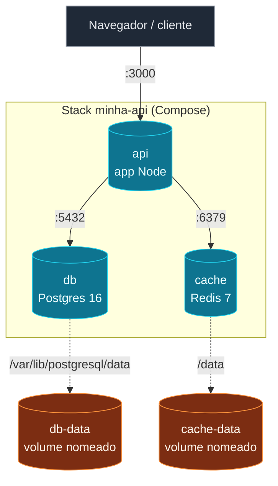

Hora de juntar tudo que vimos. O objetivo deste nó é mostrar uma
stack **realista, portável e robusta** - o tipo de `docker-compose.yml`
que você vai usar como base em vários projetos.

## A stack: API + Postgres + Redis

```yaml
services:
  api:
    build:
      context: .
      dockerfile: Dockerfile
    ports:
      - "${API_PORT:-3000}:3000"
    environment:
      NODE_ENV: ${NODE_ENV:-production}
      DATABASE_URL: postgres://app:${POSTGRES_PASSWORD}@db:5432/app
      REDIS_URL: redis://cache:6379
    depends_on:
      db:
        condition: service_healthy
      cache:
        condition: service_healthy
    restart: unless-stopped

  db:
    image: postgres:16-alpine
    environment:
      POSTGRES_USER: app
      POSTGRES_PASSWORD: ${POSTGRES_PASSWORD}
      POSTGRES_DB: app
    volumes:
      - db-data:/var/lib/postgresql/data
    healthcheck:
      test: ["CMD-SHELL", "pg_isready -U app -d app"]
      interval: 5s
      timeout: 3s
      retries: 10
    restart: unless-stopped

  cache:
    image: redis:7-alpine
    command: ["redis-server", "--save", "", "--appendonly", "no"]
    volumes:
      - cache-data:/data
    healthcheck:
      test: ["CMD", "redis-cli", "ping"]
      interval: 5s
      timeout: 3s
      retries: 10
    restart: unless-stopped

volumes:
  db-data:
  cache-data:
```



## O que cada decisão aqui faz

- **`api` com `build:`** - a imagem é construída a partir do
  `Dockerfile` local, não baixada pronta. Necessário porque o
  código da sua aplicação não existe no registry.
- **`${API_PORT:-3000}:3000`** - porta do host configurável via
  `.env`, padrão 3000. Boa pra rodar várias stacks em paralelo sem
  conflito.
- **`depends_on: condition: service_healthy`** - a API só sobe
  depois que Postgres e Redis respondem saudável. Sem isso, primeiro
  request falha.
- **`healthcheck:` no `db` e `cache`** - comando simples que
  verifica se o serviço está respondendo. `pg_isready` pro Postgres,
  `redis-cli ping` pro Redis.
- **`restart: unless-stopped`** - se o container cair (OOM, erro),
  o Docker reinicia. Não reinicia se você deu `stop` manual. Bom
  padrão pra dev e single-node prod.
- **`command: ["redis-server", "--save", "", "--appendonly", "no"]`**
  - desabilita persistência do Redis (não é cache durável). Mais
  rápido, sem dump em disco. Se você precisa de cache que sobrevive
  a restart, tire essas flags.
- **Volumes nomeados no final** - `db-data` e `cache-data` são
  declarados explicitamente. `docker compose down` mantém, `down -v`
  apaga.

## Up, logs, scale, prune

```bash
docker compose up -d                   # sobe tudo
docker compose logs -f api             # acompanha logs da API
docker compose ps                      # status (incluindo healthcheck)
docker compose exec api sh             # entra no container
docker compose exec db psql -U app -d app  # psql direto no banco
docker compose run --rm api npm run migrate  # roda migration descartável
docker compose down                    # para tudo, mantém volumes
```

Três conceitos que você acabou de aprender:

- **Healthcheck** é o que separa "stack de demo" de "stack de
  produção". Sem ele, `depends_on` não garante nada útil.
- **`restart: unless-stopped`** é a política de restart mais comum.
  `always` é mais agressivo (reinicia até depois de `stop` manual
  com timeout), `on-failure` só reinicia em erro.
- **Stack realista sempre tem healthcheck, restart policy e
  volumes nomeados declarados.** É o que faz o `docker compose up`
  ser "production-grade" sem mudar de ferramenta.

> Dica: rode `docker compose ps` sempre depois de subir. A coluna
> `STATUS` mostra `(healthy)` ou `(unhealthy)` - se ficar
> `starting` por mais de 30s, algo errado.

No próximo nó, o **projeto final** - você vai pegar uma aplicação
sua (ou de exemplo) e fazer ela rodar localmente com essa estrutura
como ponto de partida.
