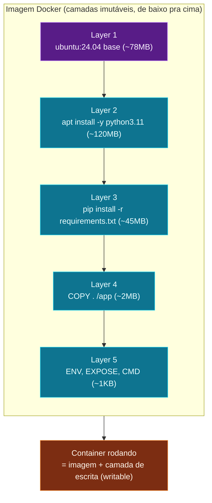

Quando você rodou `docker run nginx`, o Docker baixou uma **imagem**
chamada `nginx` de algum lugar. Esse "algum lugar" é um **registry** -
um repositório de imagens. O mais famoso é o [Docker Hub](https://hub.docker.com/),
que funciona como o GitHub das imagens: qualquer um pode publicar e
qualquer um pode baixar.

## O que é uma imagem, afinal?

Uma imagem é um **pacote imutável** que contém:

- Um sistema de arquivos base (Ubuntu, Alpine, Debian, etc.).
- As dependências da sua aplicação (Python, Node, libs do sistema).
- O código da sua aplicação.
- A configuração padrão (variáveis de ambiente, porta, comando).



Tecnicamente, uma imagem é uma pilha de **layers** (camadas). Cada
instrução do Dockerfile gera uma layer. Como o Docker usa um sistema
de arquivos union, layers são cacheados e compartilhados - isso é o
que faz o `docker run` ser tão rápido na segunda vez.

Quando o container sobe, o Docker adiciona **uma camada de escrita
(writable)** por cima. Tudo que o processo altera (criar arquivo,
instalar pacote em runtime) vai pra essa camada - e some quando o
container para. Por isso volumes existem.

## Baixando e inspecionando

```bash
docker pull nginx:1.27      # baixa versão específica
docker images               # lista o que você tem localmente
docker inspect nginx:1.27   # metadados completos (JSON longo)
```

Repare no output do `docker images`:

```text
REPOSITORY   TAG       IMAGE ID       CREATED         SIZE
nginx        1.27      a4bc7e8b8b8b   2 weeks ago     142MB
alpine       3.20      c1aabb73d233   3 weeks ago     7.4MB
```

- **REPOSITORY** - nome lógico da imagem.
- **TAG** - versão. `nginx` é o mesmo que `nginx:latest` (a mais
  recente). Em produção, **sempre use tag fixa** - `latest` muda sem
  aviso.
- **IMAGE ID** - hash imutável da imagem. Mesmo conteúdo = mesmo ID,
  mesmo que a tag mude.
- **SIZE** - tamanho total baixado. Camadas compartilhadas contam
  uma vez só no disco.

## O Docker Hub na prática

Vá em [hub.docker.com](https://hub.docker.com/) e procure "nginx".
Você verá a página oficial com:

- **Description** - o que a imagem é.
- **Tags** - todas as versões disponíveis (`1.27`, `1.26-alpine`,
  `latest`, etc.).
- **Dockerfile** - a "receita" usada pra construir a imagem
  (clicando na tag).

Imagens **oficiais** têm o selo azul "Official Image" - passaram por
revisão da Docker Inc. Pra quase tudo que você precisa (Postgres,
Redis, Python, Node, Nginx, MySQL, Mongo, etc.) tem uma imagem
oficial prontinha.

Três conceitos que você acabou de aprender:

- **Imagem** = pacote imutável baseado em camadas (layers).
- **Tag** = versão da imagem. `latest` é só um padrão, não a "mais
  recente estável garantida".
- **Registry** = repositório de imagens. Docker Hub é o público;
  empresas rodam o seu próprio (Harbor, GitHub Packages, AWS ECR).

> Dica: imagens Alpine (5-7 MB) são minúsculas em comparação com Debian
> ou Ubuntu. Pra imagens finais, Alpine quase sempre é a melhor escolha
> - a gente aprofunda no nó de **imagens eficientes**.

No próximo, vamos parar de só **rodar** imagens prontas e criar a
nossa própria, com Dockerfile.
