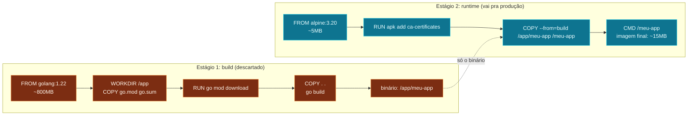

Você criou sua imagem, mas ela está com 1.2 GB e demora 5 minutos
pra baixar. **Tamanho importa**: imagens grandes custam mais em
tráfego, demoram mais pra subir, e têm mais superfície de ataque.
Boa parte desse tamanho geralmente é **desnecessário** - ferramentas
de build, código-fonte, caches, arquivos de teste. Vamos cortar.

## Escolha a base certa

```dockerfile
# Pesado (1+ GB)
FROM node:20

# Leve (~180 MB)
FROM node:20-slim

# Minimalista (~50 MB)
FROM node:20-alpine
```

`alpine` é uma distribuição Linux com 5 MB de base. Quase tudo roda
nela, mas algumas libs nativas podem dar dor de cabeça (musl vs
glibc). `slim` é Debian sem os extras - meio termo. Pra produção,
**alpine ou distroless** quando dá.

## Ordem das instruções (de novo, e agora com mais razão)

Docker cacheia cada layer. Se você mudar uma linha no fim do Dockerfile,
as layers anteriores não precisam ser refeitas. Então:

```dockerfile
# Errado - qualquer mudança no código invalida o npm install
COPY . .
RUN npm install

# Certo - mudanças no código não invalidam a install
COPY package*.json ./
RUN npm install
COPY . .
```

## .dockerignore - o guarda-costas do seu build

Crie um `.dockerignore` na raiz (mesmo conceito do `.gitignore`):

```text
node_modules
.git
.env
*.log
.DS_Store
tests
coverage
```

Sem isso, o `COPY . .` copia **tudo** - incluindo `node_modules` local
(se houver), `.git`, e arquivos de teste. A imagem incha e o build
demora.

## Multi-stage build - o canivete suíço

Multi-stage build deixa você compilar numa imagem "completa" e
copiar **só o artefato final** pra uma imagem mínima. Exemplo com
Go (mas o padrão vale pra Rust, Java, C, etc.):

```dockerfile
# Estágio 1: compila (imagem com tudo que precisa)
FROM golang:1.22 AS build
WORKDIR /app
COPY go.mod go.sum ./
RUN go mod download
COPY . .
RUN CGO_ENABLED=0 go build -o meu-app

# Estágio 2: executa (imagem mínima, sem Go)
FROM alpine:3.20
RUN apk add --no-cache ca-certificates
COPY --from=build /app/meu-app /meu-app
EXPOSE 8080
CMD ["/meu-app"]
```

A imagem final tem ~15 MB em vez de ~800 MB. Tudo que precisava do
Go (compilador, source, cache) ficou no primeiro estágio e foi
descartado. Só o **binário** vai pra imagem final.



A imagem final tem ~15 MB em vez de ~800 MB. Tudo que precisava do
Go (compilador, source, cache) ficou no primeiro estágio e foi
descartado. Só o **binário** vai pra imagem final.

- **Base image enxuta** (`alpine`, `slim`, `distroless`) corta MB
  sem perder funcionalidade na maioria dos casos.
- **`.dockerignore`** evita copiar lixeira pra dentro da imagem.
- **Multi-stage build** separa "compilar" de "rodar" - a imagem
  final só tem o que precisa pra executar.

> Dica: use `docker images` antes e depois pra ver o tamanho. E
> [`dive`](https://github.com/wagoodman/dive) é uma ferramenta
> gratuita que mostra **camada por camada** o que está ocupando
> espaço - útil pra investigar imagens inchadas.

No próximo nó - o fechamento da trilha - vamos juntar tudo isso
numa aplicação real.
