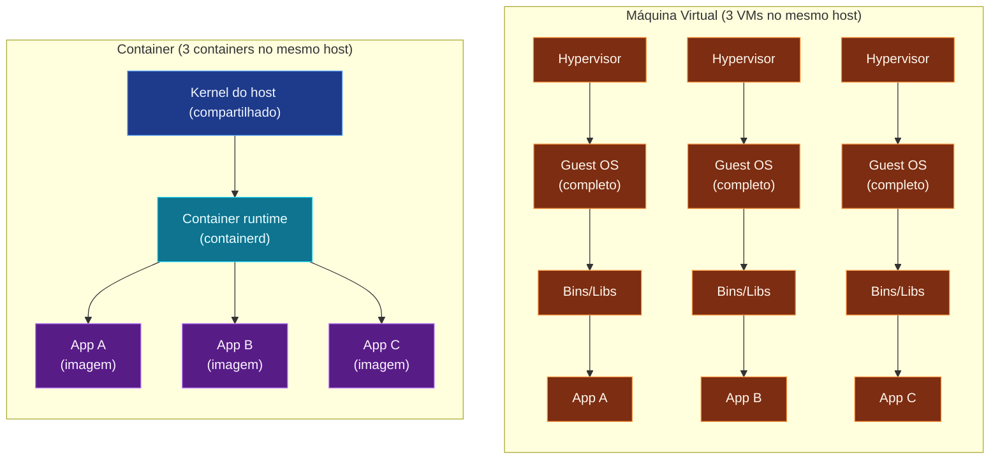

Todo mundo que já trabalhou com software passou por isso: "na minha máquina
funciona". Um colega roda Windows, outro macOS, o servidor de produção é
Linux, e a tal aplicação que funcionava ontem agora quebra. **Container** é a
resposta moderna pra esse problema - um jeito de empacotar uma aplicação
junto com **tudo** que ela precisa pra rodar, e rodar igual em qualquer lugar.

## Container não é máquina virtual

Muita gente confunde. Uma VM emula um hardware inteiro e sobe um sistema
operacional completo por cima do seu. Um **container** é só um processo
da sua máquina, isolado do resto por mecanismos do próprio Linux (namespaces
e cgroups). Ele é leve, sobe em segundos e compartilha o kernel com o host.

Repare: três VMs precisam de **três kernels separados** rodando
em paralelo. Três containers compartilham **um único kernel** (o do
host) - o que sobra é só o sistema de arquivos da imagem e o processo
da app. Daí a diferença brutal de tamanho e tempo de boot.

|                | Máquina Virtual           | Container                        |
| -------------- | ------------------------- | -------------------------------- |
| Inicialização  | Minutos                   | Segundos (ou milissegundos)      |
| Tamanho        | Gigabytes (SO completo)   | Megabytes (só a app + deps)      |
| Desempenho     | Quase nativo              | Nativo (é um processo do host)   |
| Isolamento     | Total (kernel próprio)    | Parcial (compartilha o kernel)   |

A imagem mental que ajuda: **container é um processo "embrulhado"** com
tudo que ele precisa. Sobe rápido, morre rápido, e vários podem rodar
lado a lado sem se pisar.

## Docker é a ferramenta, container é o conceito

**Docker** é o programa que cria, roda e distribui containers. Foi
lançado em 2013 e virou praticamente sinônimo de "container" - mas é
importante saber que existem outros (containerd, Podman, CRI-O). O
ecossistema Docker, porém, é o mais didático e o mais usado.

Três peças que vão aparecer o tempo todo:

- **Imagem** - o "molde" do container. Um arquivo que descreve o sistema
  de arquivos, dependências e comando de inicialização. É **imutável**.
- **Container** - a instância rodando de uma imagem. Você pode ter
  dez containers da mesma imagem.
- **Registry** - o repositório onde você guarda imagens (Docker Hub é o
  maior; empresas usam GitHub Container Registry, AWS ECR, etc.).

No próximo nó, vamos instalar o Docker e rodar o primeiro container
- a "hello world" do mundo container.

> Dica: o símbolo da baleia com containers em cima é a marca do Docker.
> Quando alguém fala "dockerizar uma aplicação", significa **empacotá-la
> numa imagem Docker**.
