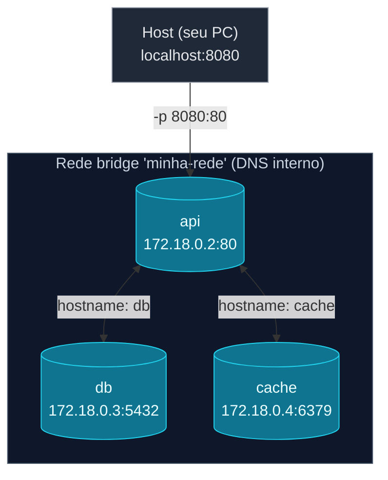

Um app de verdade quase nunca é um container sozinho. É banco + API +
cache, às vezes fila, às vezes frontend. Pra esses containers se
acharem pelo nome (em vez de IP, que muda toda vez que o container
sobe), você precisa de **networks**.

## O problema: IP não é confiável

```bash
docker run -d --name db -e POSTGRES_PASSWORD=secret postgres:16
docker inspect db | grep IPAddress
# "IPAddress": "172.17.0.2"
```

Esse IP muda toda vez que o container sobe. Imagina configurar a
aplicação pra apontar pro IP do banco - quebra em qualquer restart.

## A solução: rede bridge customizada + DNS

Quando você cria uma rede bridge customizada, o Docker sobe um **DNS
interno** que resolve o nome do container pra IP atual. É mágica.



```bash
docker network create minha-rede

docker run -d --name db --network minha-rede \
  -e POSTGRES_PASSWORD=secret postgres:16

docker run -d --name api --network minha-rede \
  -e DATABASE_URL=postgres://postgres:secret@db:5432/postgres \
  minha-api
```

Repare: a string de conexão aponta pra `db:5432` - **o nome do
container**, não o IP. Quando a API faz a requisição, o DNS do Docker
resolve `db` pro IP atual automaticamente.

```bash
docker network ls                  # lista
docker network inspect minha-rede  # vê quem está conectado
docker network connect minha-rede outro-container  # conecta um já rodando
docker network disconnect minha-rede outro-container
```

## Os três drivers que você vai encontrar

- **`bridge`** (padrão) - rede privada virtual dentro do host. Containers
  se acham por nome. É o que você usa em dev e em produção.
- **`host`** - o container usa a rede do host **diretamente**, sem
  isolamento. Mais performance, menos segurança. Útil em alguns casos
  de monitoramento.
- **`none`** - sem rede. Pra batch jobs que não precisam de rede.

## Comunicação com o "mundo externo"

Quando você faz `-p 8080:80`, o Docker cria uma regra de NAT que
**abre a porta 8080 do seu host** e redireciona pra porta 80 do
container. É assim que você acessa o serviço no navegador.

```bash
docker run -d -p 8080:80 --name web nginx
```

- Sem `-p`: container acessível só por outros containers na mesma rede.
- Com `-p 8080:80`: acessível em `localhost:8080` no host.
- Com `-p 8080:80 -p 8443:443`: duas portas expostas.

> **Cuidado com conflito de portas.** Se você já tem algo na porta 8080
> do host, o Docker não sobe o container. Mude o mapeamento:
> `-p 9090:80` resolve.

Três conceitos que você acabou de aprender:

- **IP de container é volátil** - nunca hardcode. Use o **nome** do
  container como hostname.
- **Rede bridge customizada** dá DNS interno. Containers na mesma
  rede se acham por nome automaticamente.
- **`-p host:container`** expõe porta pro mundo externo. Sem `-p`,
  o container é invisível fora da rede Docker.

> Dica: o **`docker-compose`** cria uma rede pra você automaticamente
> e configura tudo isso de forma declarativa. É o tema da próxima
> trilha, depois desta. Pra já ter um gostinho: o `docker-compose.yml`
> faz em 10 linhas o que fizemos em 4 comandos aqui.

No próximo nó, vamos falar de **imagens eficientes** - como deixar
sua imagem menor, mais rápida de baixar e mais segura.
