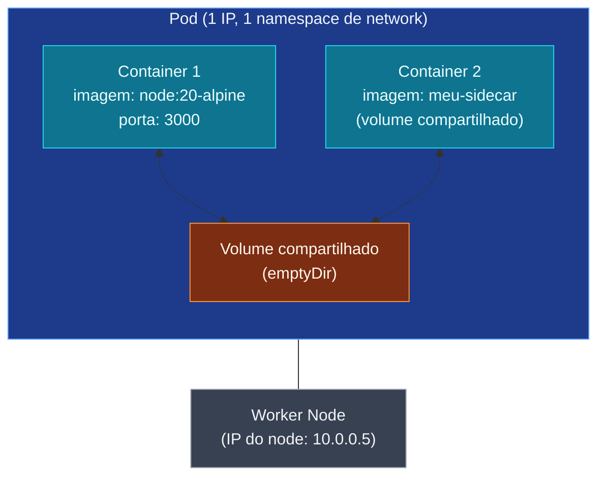

O **Pod** é a menor unidade que o k8s gerencia. Quando você "roda
um container" no k8s, na verdade você roda um **Pod que contém um
container** (ou mais). O Pod é o "envelope" - ele compartilha
network e storage entre os containers que abriga.

## Anatomia de um Pod



Pontos importantes do diagrama:

- **1 Pod = 1 IP** (dentro da rede do cluster). Todos os containers
  dentro do Pod compartilham esse IP e o mesmo namespace de network.
- **Containers no mesmo Pod conversam via `localhost`** - o
  `container 1` chama o `container 2` em `http://localhost:porta`.
- **Volume compartilhado** (do tipo `emptyDir`) - os containers
  enxergam a mesma pasta. Útil pra sidecar que processa arquivos
  do app principal.
- **Pod é efêmero** - se o Pod morre (node cai, OOM, restart), os
  dados em `emptyDir` somem. Pra persistência de verdade, use
  `PersistentVolume` (nó mais à frente).

## O manifesto mínimo

```yaml
apiVersion: v1
kind: Pod
metadata:
  name: meu-app
  labels:
    app: api
spec:
  containers:
    - name: api
      image: luciano/api:1.0
      ports:
        - containerPort: 3000
      env:
        - name: NODE_ENV
          value: production
      resources:
        requests:
          cpu: 100m
          memory: 128Mi
        limits:
          cpu: 500m
          memory: 256Mi
```

Aplique e veja:

```bash
kubectl apply -f pod.yaml
kubectl get pod meu-app
kubectl describe pod meu-app
kubectl logs meu-app
kubectl delete pod meu-app
```

## Quando usar Pod "solto"

Quase nunca. O Pod sozinho não tem:

- Auto-recuperação (cai e não volta).
- Replicação (você não diz "quero 3").
- Rolling update.

Pra isso existe o **Deployment**, que é o que cria e gerencia Pods
na prática (próximo nó). Use Pod solto só pra:

- **Debug rápido** - `kubectl run` cria um pod descartável com
  imagem específica.
- **Jobs de uma execução** - batch jobs que rodam e terminam.
- **Sidecar patterns avançados** - alguns casos legítimos de
  Pods multi-container com sidecars (service mesh, log shipper).

## `kubectl run` pra debug

```bash
kubectl run debug --rm -it --image=alpine -- sh
# equivalente a: subir um pod descartável (-rm remove ao sair)
#               com a imagem alpine, e abrir shell interativo (-it)
```

Três conceitos que você acabou de aprender:

- **Pod** é a menor unidade, mas na prática você quase sempre usa
  **Deployment** ou **StatefulSet** que gerenciam Pods.
- **Containers no mesmo Pod compartilham network (`localhost`) e
  volumes** - útil pra sidecars, confuso se você não souber.
- **Pod é efêmero** - tudo que importa (estado, identidade) tem
  que ser gerenciado pelos controllers (Deployment, StatefulSet).

> Dica: ao descrever um Pod (`kubectl describe pod`), a seção
> "Events" no fim mostra o que o k8s está fazendo. "Pulling",
> "Created", "Started" = saudável. "BackOff", "Failed", "OOMKilled"
> = tem erro.

No próximo nó, vamos parar de criar Pods na mão e usar **Deployment**,
que é o controller que você usa 95% do tempo.
