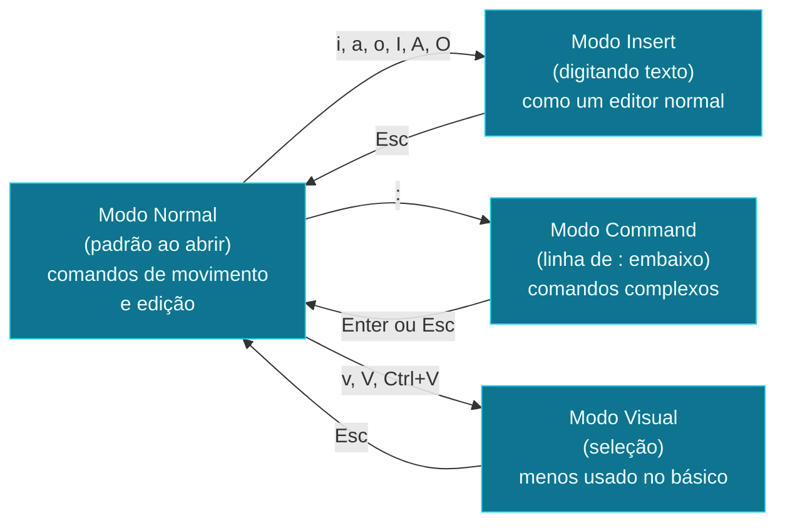

Você vai editar arquivo de config num servidor remoto. O que tem
disponível? Em Linux, **vim** ou **nano** quase sempre. Em macOS,
só **vim** (sem `nano` por default, mas instalável). Aprenda o
mínimo de pelo menos um - o outro é só conveniência.

## `nano` - o editor amigável

O `nano` é o editor "WYSIWYG-ish" do terminal. Os comandos ficam
visíveis na parte de baixo da tela.

```bash
nano arquivo.txt                    # abre
```

Dentro do `nano`:

- Digite normalmente - o texto aparece onde o cursor está
- `Ctrl + O` - salva (`O` de "output", ou "writeOut")
- `Ctrl + X` - sai (pergunta se quer salvar)
- `Ctrl + K` - corta a linha atual
- `Ctrl + U` - cola
- `Ctrl + W` - busca
- `Ctrl + C` - cancela comando atual

Os atalhos aparecem na tela (canto inferior). É a vantagem
principal: visíveis, descobríveis. Pra edições simples, é
perfeito.

> **Por que `nano` em servidores**: ele vem pré-instalado em
> praticamente toda distro Linux. Não tem curva de aprendizado
> significativa. Se você não sabe nada de vim, use nano.

## `vim` - o editor onipresente

O `vim` (vi improved) é mais velho, mais complicado, mais
poderoso. **Está em todo lugar** - qualquer unix-like do mundo
tem `vi` ou `vim`. Vale aprender o mínimo.

### Os 3 modos



**A armadilha clássica**: você abre o vim, tenta digitar, e
nada funciona (ou pior, caracteres estranhos aparecem). É porque
você tá no **modo Normal** - que serve pra **comandos**, não
pra digitar texto. Aperte `i` (insert) e comece a digitar.

### O mínimo que você precisa

```bash
vim arquivo.txt                     # abre (modo Normal)
```

Dentro do `vim`:

**Sair (o motivo #1 de pânico)**:

- `:q` - sai (falha se tiver mudanças não salvas)
- `:q!` - sai sem salvar (força)
- `:wq` - salva e sai
- `:x` - mesma coisa, mais curto
- `ZZ` - mesma coisa, sem o `:` (modo Normal)

**Mover o cursor** (modo Normal):

- `h` `j` `k` `l` - esquerda, baixo, cima, direita (setas
  também funcionam)
- `w` - próxima palavra
- `b` - palavra anterior
- `0` - início da linha
- `$` - fim da linha
- `gg` - início do arquivo
- `G` - fim do arquivo
- `:42` - vai pra linha 42

**Editar (modo Normal)**:

- `i` - entra no modo Insert no cursor
- `a` - entra no modo Insert **depois** do cursor
- `A` - entra no modo Insert no fim da linha
- `o` - nova linha abaixo e entra em Insert
- `O` - nova linha acima e entra em Insert
- `Esc` - volta pro modo Normal
- `dd` - deleta a linha inteira
- `dw` - deleta a palavra
- `d$` - deleta do cursor até o fim da linha
- `u` - undo (desfazer)
- `Ctrl + r` - redo (refazer)
- `yy` - copia a linha (yank)
- `p` - cola abaixo do cursor
- `P` - cola acima do cursor
- `/palavra` - busca pra frente
- `?palavra` - busca pra trás
- `n` - próxima ocorrência
- `:%s/velho/novo/g` - substitui em todo o arquivo

> **Os 10 comandos que cobrem 90% do uso**: `i`, `Esc`, `:wq`,
> `dd`, `u`, `/palavra`, `n`, `gg`, `G`, `0`. Aprenda esses,
> você sobrevive no vim.

### O `.vimrc` - configurando o vim

Crie `~/.vimrc`:

```vim
" comentários começam com aspas duplas
set number              " mostra número de linha
set relativenumber      " mostra número relativo (5 linhas acima/abaixo)
set tabstop=2           " tab = 2 espaços
set shiftwidth=2        " indent = 2 espaços
set expandtab           " tab vira espaço (não TAB literal)
set autoindent          " mantém indent na próxima linha
set hlsearch            " destaca resultados de busca
set incsearch           " busca incremental (enquanto digita)
set ignorecase          " busca case-insensitive
set smartcase           " mas case-sensitive se tiver maiúscula
syntax on               " colore sintaxe
```

> **`vim` no macOS**: o que vem pré-instalado é antigo (vim
> 7.x). Pra vim 9+ com suporte melhor a Neovim, instale via
> Homebrew: `brew install vim`. Pra trocar o default,
> `alias vi='/opt/homebrew/bin/vim'` no `~/.zshrc`.

## Emergência: `nano` quando tudo dá errado

Se você abriu o vim sem querer e está preso (não sabe sair),
**saia**: aperte `Esc` até garantir que tá no modo Normal,
depois digite `:q!` e Enter. Isso sai sem salvar. Se mesmo
isso não funcionar, `Ctrl + C`, `Ctrl + Z` (suspende), depois
`kill %1`.

Se o vim parecer ameaçador demais, instale o `nano` no servidor:

```bash
# Linux
sudo apt install nano
# macOS
brew install nano
```

E use `nano arquivo.txt` em vez de `vim`. Sem vergonha - o
objetivo é editar o arquivo, não provar que você é hacker.

Três conceitos que você acabou de aprender:

- **Vim tem 3 modos** (Normal, Insert, Command). A armadilha
  clássica é digitar no modo Normal. Aperte `i` pra digitar,
  `Esc` pra voltar.
- **Sair do vim é `:q!` (sair sem salvar) ou `:wq` (salvar e
  sair)**. `ZZ` é o atalho sem `:`.
- **`nano` é mais simples e descobrível** (atalhos visíveis).
  Use se vim parecer demais - não há vergonha nisso.

> Dica: se você vai usar vim com frequência, vale a pena
> instalar o [VSCode](https://code.visualstudio.com/) com a
> extensão "Remote SSH" - você edita arquivos remotos no
> editor local, com todo o conforto do VSCode (IntelliSense,
> multi-cursor, etc) e a capacidade de salvar direto no
> servidor. A melhor das duas opções.

No próximo e último nó, o **projeto final**: você vai
diagnosticar e arrumar um servidor "quebrado" - uma série
de problemas realistas (porta ocupada, permissão negada,
serviço travado) que vão consolidar tudo que você aprendeu.
