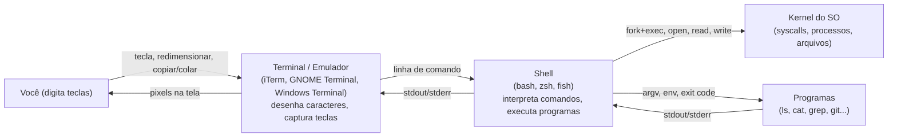

Quando você abre aquela janela preta com texto, o que aparece é
três coisas ao mesmo tempo - e vale entender qual é qual antes de
sair digitando comandos no escuro.

## Os três personagens



- **Terminal** (emulador) é o **desenhador**. Ele captura o que
  você digita, mostra a saída, e desenha a janela. Hoje em dia
  rodam como qualquer app gráfico (iTerm2 no macOS, GNOME
  Terminal no Linux, Windows Terminal no Windows).
- **Shell** é o **intérprete**. Quando você aperta Enter, o
  terminal manda a linha pro shell, que decide o que fazer. **bash**
  é o padrão histórico em Linux; **zsh** é o padrão do macOS desde
  Catalina (2019). Os dois compartilham 90% da sintaxe.
- **Kernel** é o que faz o trabalho real. O shell é só uma forma
  conveniente de pedir "abre esse arquivo", "roda esse programa".

Se o shell é o "cérebro" da conversa, o terminal é o "telefone".
Você pode trocar qualquer um dos dois sem mudar os outros - trocar
de iTerm pra GNOME Terminal não muda o que bash faz, e trocar de
bash pra zsh não muda o que o terminal desenha.

## O prompt

A linha que aparece quando o shell está pronto pra você digitar:

```text
luciano@meu-mac minha-api % █
```

Cada parte tem significado:

- `luciano` - nome do usuário.
- `meu-mac` - nome do host (computador).
- `~/Projetos/minha-api` - diretório atual. O `~` é um atalho pra
  `$HOME` (a pasta home do usuário).
- `%` - prompt do **zsh**. O bash usa `$` por padrão. Se você ver
  `#` em vez disso, é o shell do root.
- O bloco sólido `█` - cursor piscando, esperando você digitar.

## Como abrir um terminal

- **macOS**: `Cmd + Espaço` -> digita "Terminal" -> Enter. Pra
  instalar o [iTerm2](https://iterm2.com/) (mais configurável), baixe
  do site oficial. Recomendo.
- **Linux**: depende do ambiente. GNOME: barra de apps -> Terminal.
  KDE: mesma coisa. Quase toda distro tem um atalho `Ctrl + Alt + T`.
- **Windows**: instale o **WSL2** (Windows Subsystem for Linux). É
  a forma canônica em 2026 - te dá um Linux completo dentro do
  Windows. Abra a Microsoft Store, instale "Ubuntu" (ou similar),
  rode. O `wsl` no PowerShell abre o terminal do Linux direto.

> **WSL2 vs WSL1**: use **WSL2**. É o padrão desde 2020, roda um
> kernel Linux de verdade numa VM leve, e o desempenho de I/O é
> muito melhor.

## Primeiro comando

```bash
echo "oi, terminal"
```

Você acabou de:
1. Digitar uma string (`"oi, terminal"`) na linha.
2. Passar ela pro comando `echo`, que é um programa que **imprime
   seus argumentos no stdout**.
3. O shell imprimiu `oi, terminal` e voltou pro prompt.

`echo` é o "hello world" do terminal - útil pra testar se tudo
funciona. Os próximos nós vão entrar nos comandos que você vai
usar de verdade.

Três conceitos que você acabou de aprender:

- **Terminal ≠ shell** - um desenha, o outro interpreta. Você
  pode trocar de um sem trocar do outro.
- **O prompt** tem info útil: usuário, host, diretório atual,
  tipo de shell.
- **macOS usa zsh, Linux usa bash, Windows usa WSL2 (Linux)** -
  os três compartilham a maior parte da sintaxe.

> Dica: o atalho `Ctrl + L` limpa a tela (igual o comando `clear`).
> Útil quando o terminal fica poluído.

No próximo nó, vamos começar a se mover: `pwd`, `ls` e `cd`.
