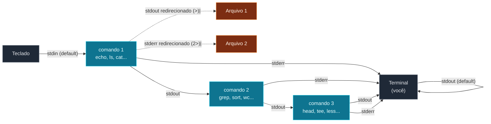

Esse é o nó que muda como você pensa sobre o terminal. Quando
você entende pipes, comandos isolados viram **blocos
construtores** que se combinam. Onde antes você precisava de
scripts, agora um one-liner resolve.

## O modelo: 3 fluxos

Todo processo Unix tem **3 canais de I/O** pré-definidos:

- **stdin** (entrada padrão, fd 0) - de onde o processo lê
  input. Por padrão, vem do teclado.
- **stdout** (saída padrão, fd 1) - onde o processo escreve o
  output normal. Por padrão, vai pro terminal.
- **stderr** (erro padrão, fd 2) - onde o processo escreve
  mensagens de erro. Por padrão, **também** vai pro terminal, mas
  é um canal separado (você pode redirecionar sem misturar com
  stdout).



A beleza do modelo: você **redireciona ou conecta** esses canais
com sintaxe simples, e o resto se resolve.

## Redirecionamento: `>`, `>>`, `<`, `2>`

```bash
# stdout -> arquivo (sobrescreve)
ls > listagem.txt

# stdout -> arquivo (anexa, sem sobrescrever)
echo "mais uma linha" >> listagem.txt

# stdin <- arquivo
sort < entrada.txt                  # mesma coisa que: sort entrada.txt

# stderr -> arquivo
comando-que-da-erro 2> erros.log

# stdout e stderr juntos
comando > tudo.log 2>&1              # 'tudo.log' recebe stdout E stderr
comando &> tudo.log                  # atalho (bash 4+, zsh) pra mesma coisa
comando > tudo.log 2> erros.log      # separa stdout e stderr em 2 arquivos
```

> **Cuidado com `>`**: sobrescreve sem perguntar. Cria o arquivo
> se não existir. `set -o noclobber` no shell desabilita
> sobrescrita (erro se arquivo existe).

> **`2>&1` vs `2>01`**: a ordem importa. `comando > out 2>&1` manda
> stderr pro MESMO lugar que stdout (que é o arquivo). `comando
> 2>&1 out` manda stderr pro stdout atual (terminal) e DEPOIS
> redireciona stdout pro arquivo - resultado diferente. Regra:
> redirecione stderr DEPOIS de redirecionar stdout.

## Pipes: `|`

O pipe é a peça mais útil do shell. Liga a stdout de um comando
na stdin do próximo:

```bash
# sem pipe, com redirect temporário
ls /usr/bin > /tmp/lista.txt
grep "^a" /tmp/lista.txt
rm /tmp/lista.txt

# com pipe, sem arquivo temporário
ls /usr/bin | grep "^a"
```

`|` é um "pipe" no sentido literal: a stdout do esquerdo vira
stdin do direito. Sem limite de encadeamento:

```bash
# pega o último log de erro, extrai IP, conta
grep "ERROR" app.log | grep -oE "\b([0-9]{1,3}\.){3}[0-9]{1,3}\b" | sort | uniq -c | sort -rn

# processo rodando? qual o PID?
ps aux | grep "node" | grep -v grep | awk '{print $2}'

# arquivos modificados hoje, maiores que 1MB, só os 10 primeiros
find . -mtime 0 -size +1M | head
```

> **Cuidado**: o pipe liga **só** stdout, não stderr. Se você
> quiser ambos, redirecione stderr pra stdout primeiro:
> `comando 2>&1 | grep "x"`.

## `tee` - divide o fluxo

`tee` lê da stdin e escreve simultaneamente na stdout **e** num
arquivo. Útil pra ver e salvar ao mesmo tempo:

```bash
# mostra na tela e salva em log
comando-longo | tee saida.log

# acumula em vários arquivos
comando | tee -a log1.log -a log2.log
```

## `xargs` - converte stdin em argumentos

Muitos comandos não aceitam stdin - aceitam **argumentos** via
linha de comando. `xargs` converte:

```bash
# apaga todos os .tmp encontrados
find . -name "*.tmp" | xargs rm

# versão mais segura (lida com nomes com espaço)
find . -name "*.tmp" -print0 | xargs -0 rm

# conta linhas de todos os .js
find src -name "*.js" | xargs wc -l
```

`xargs` é o "cola" entre `find` (que produz listas) e comandos
que não leem de stdin.

Três conceitos que você acabou de aprender:

- **stdin, stdout, stderr** são os 3 canais de I/O. Redireciona
  com `>`, `>>`, `<`, `2>`.
- **Pipe (`|`)** liga stdout de um na stdin do próximo. Permite
  encadear comandos como se fossem funções.
- **`xargs`** converte stdin em argumentos - cola entre `find` e
  comandos que não leem stream.

> Dica: o atalho `Ctrl + R` (busca no histórico) e pipes são
> as duas ferramentas que mais economizam tempo no dia a dia.
> Pipe é "compor funções"; `Ctrl + R` é "achar o que você já
> fez antes". Aprendeu os dois, a velocidade de trabalho muda
> radicalmente.

No próximo nó, processamento de texto: `sed`, `awk`, `cut`,
`sort`, `uniq` - as ferramentas que fazem coisas que GUI
demoraria horas pra fazer.
