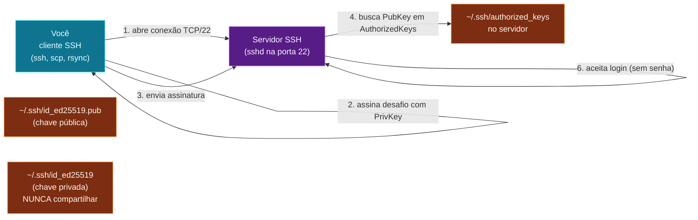

SSH (Secure Shell) é o protocolo padrão pra **logar em outra
máquina** com criptografia. É também o canivete: copia arquivos,
cria túneis, executa comandos remotos. Quem domina SSH consegue
operar qualquer servidor unix do mundo.

## O modelo: cliente, servidor, chaves



A mágica: o servidor tem a **chave pública** do cliente. O
cliente prova que tem a **chave privada** correspondente. Nunca
a senha é enviada - mesmo se a conexão for interceptada, o
invasor não consegue nada.

## Gerando chaves

```bash
ssh-keygen -t ed25519 -C "seu@email.com"
# Generating public/private ed25519 key pair.
# Enter file in which to save the key (~/.ssh/id_ed25519):
# Enter passphrase (empty for no passphrase):

ls ~/.ssh/
# id_ed25519       (privada - NUNCA compartilhe)
# id_ed25519.pub   (pública - distribui pros servidores)
```

O algoritmo **ed25519** é o padrão moderno - menor, mais rápido,
mais seguro que RSA. Use-o a menos que tenha razão específica pra
RSA (sistemas antigos).

> **A chave privada é sagrada**. Quem tem ela tem acesso a
> **tudo** que ela abre. Permissão `chmod 600 ~/.ssh/id_ed25519`
> (só você lê). **Nunca** commita no Git. **Nunca** copia pra
> outro lugar.

## Copiando a chave pública pro servidor

```bash
# se o servidor tem ssh-copy-id (Linux geralmente tem)
ssh-copy-id usuario@servidor

# sem ssh-copy-id (macOS não vem por padrão)
cat ~/.ssh/id_ed25519.pub | ssh usuario@servidor "mkdir -p ~/.ssh && chmod 700 ~/.ssh && cat >> ~/.ssh/authorized_keys && chmod 600 ~/.ssh/authorized_keys"

# manual: abre o arquivo e cola o conteúdo no servidor
cat ~/.ssh/id_ed25519.pub             # imprime a chave pública
ssh usuario@servidor                  # loga com senha
# no servidor:
nano ~/.ssh/authorized_keys           # cola a chave
chmod 600 ~/.ssh/authorized_keys
```

Depois disso, `ssh usuario@servidor` não pede mais senha.

## Usando SSH

```bash
ssh usuario@servidor                 # conecta
ssh usuario@192.168.1.100            # IP direto
ssh -p 2222 usuario@servidor         # porta custom (default 22)
ssh -i ~/.ssh/chave-especifica usuario@servidor  # chave específica
```

## `~/.ssh/config` - atalhos e defaults

```bash
# ~/.ssh/config (crie se não existir)
Host meuserver
    HostName 203.0.113.50
    User deploy
    Port 2222
    IdentityFile ~/.ssh/id_ed25519

Host *.empresa.com
    User meu-user
    IdentityFile ~/.ssh/trabalho

Host bastion
    HostName bastion.empresa.com
    User admin
```

Agora:

```bash
ssh meuserver                         # expande pro comando completo
scp arquivo.txt meuserver:~           # scp também respeita o config
```

Vale muito criar aliases. Em vez de digitar `ssh
deploy@203.0.113.50 -p 2222 -i ~/.ssh/id_ed25519`, só `ssh
meuserver`.

## Copiando arquivos: `scp` e `rsync`

```bash
# local -> remoto
scp arquivo.txt usuario@servidor:/tmp/
scp -r diretorio/ usuario@servidor:~/projetos/

# remoto -> local
scp usuario@servidor:/var/log/app.log .

# entre dois remotos (passa pela sua máquina)
scp usuario1@host1:/arquivo usuario2@host2:/destino
```

`rsync` é `scp` com **delta sync** (só copia o que mudou) e
mais opções:

```bash
rsync -avzP ./local/ usuario@servidor:/remote/   # archive, verbose, compress, progress
rsync -avzP --delete ./local/ usuario@servidor:/remote/  # deleta no destino o que não existe aqui
```

A `-a` (archive) é quase sempre o que você quer: preserva
permissões, dono, symlinks, recursivo. A `-z` comprime. A `-P`
mostra progresso e permite retomar transferência interrompida.

> **Use `rsync` em vez de `scp` pra coisas grandes**. `scp`
> sempre copia tudo. `rsync` só copia o delta. Pra deploys de
> pasta grande, a diferença é brutal.

## Túneis: `-L` e `-D`

SSH pode criar **túneis** - encaminhar uma porta local pra uma
máquina remota, atravessando a conexão criptografada.

```bash
# porta local 8080 -> servidor:80
ssh -L 8080:localhost:80 usuario@servidor

# acesso ao banco interno (servidor-db:5432) via porta local
ssh -L 5432:db-interno:5432 usuario@bastion
# agora psql -h localhost -p 5432 funciona localmente, mas fala com o db-interno

# SOCKS proxy (tunela todo o tráfego via SSH)
ssh -D 1080 usuario@servidor
# configura o navegador pra usar SOCKS5 em localhost:1080
```

Túneis são a forma mais simples de acessar serviços internos
sem expor a internet. Combinado com `~/.ssh/config` + alias no
shell, fica trivial.

## ssh-agent - não digitar passphrase toda hora

Se sua chave tem passphrase (boa prática!), o `ssh-agent`
desbloqueia ela uma vez e mantém em memória:

```bash
eval "$(ssh-agent -s)"              # inicia agent
ssh-add ~/.ssh/id_ed25519          # adiciona chave (pede passphrase 1x)
ssh meuserver                      # não pede nada
```

> **macOS**: o `Keychain Access` integra com `ssh-agent` -
> adiciona a chave uma vez e ela fica desbloqueada pra sempre
> (até você desligar o Mac). Configure com
> `ssh-add --apple-use-keychain ~/.ssh/id_ed25519`.

Três conceitos que você acabou de aprender:

- **Chave privada é sagrada** - nunca compartilha, permissão
  600, nunca no Git. Chave pública vai pro servidor, em
  `~/.ssh/authorized_keys`.
- **`~/.ssh/config`** vira aliases legíveis (`ssh meuserver`)
  com defaults (user, port, key). Use sempre.
- **Túneis SSH (`-L`)** acessam serviços internos sem expor
  porta. Combinado com bastion, é o padrão de acesso seguro a
  infra privada.

> Dica: o `mosh` (mobile shell) é SSH com reconexão automática
> - útil em conexões instáveis (WiFi de café, 4G). Não substitui
> SSH pra transferências, mas pra shell interativo é imbatível.

No próximo, compactação: `tar`, `gzip`, `zip` - como empacotar
e desempacotar arquivos (especialmente logs pra mandar pro
suporte).
